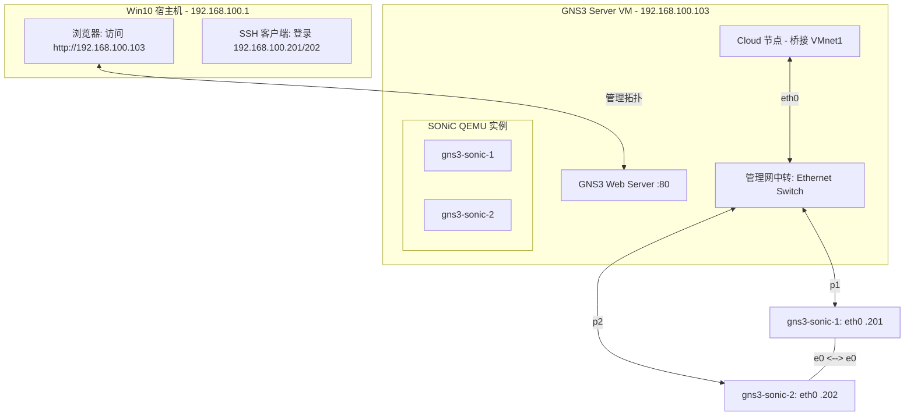

# GNS3 + Broadcom SONiC (VirtualSwitch) 实验环境搭建 (Web UI 版)

## 1. 物理层：VMware Workstation 17 Pro 核心配置

为了运行 SONiC，**必须使用 GNS3 VM (VMware)** 而非 Win10 本地 Server，以获得 KVM 硬件加速支持。

### A. GNS3 VM (Server) 硬件调优

* **嵌套虚拟化 (核心)**: 在 VM 设置中勾选 **"Virtualize Intel VT-x/EPT"**。若不开启，SONiC 内部的 Redis 数据库与各容器同步将极其缓慢，甚至无法启动。
* **内存 (RAM)**: 分配 **16GB** 或以上。
* **网卡规划**:
* **Adapter 2**: **Host-Only (VMnet1)** -> 映射到 GNS3 中的 `Cloud` 节点，作为管理流量出口。


### B. 为什么不建议在 Win10 直接装 Server (Local Server)？

* **性能瓶颈**: Windows 原生 QEMU 无法调用 KVM，仅能通过 WHPX 模拟，效率极低。SONiC 启动可能从 3 分钟延长至 30 分钟。
* **驱动失效**: Broadcom 镜像高度依赖 **virtio-net-pci**。在 Windows 版 QEMU 中，该驱动常导致 `show interface status` 结果为空，导致“看得见（管理口通）管不了（业务口废）”的窘境。

---

## 2. Web UI 模板配置 (参考 STORDIS 最佳实践)

在 `http://192.168.100.103` 创建模板时，请严格按照以下参数配置，否则业务接口无法正常工作：

* **镜像**: [Broadcom/sonic-VirtualSwitch (GitHub)](https://github.com/Broadcom/sonic-VirtualSwitch)
* **计算**: **8192 MB RAM** / **4 vCPU**。
* **网卡驱动 (核心)**: 必须选择 **virtio-net-pci**。
* **端口定义**:
* **First port name**: `eth0` (管理口)
* **Name format**: `Ethernet{0}` (业务口)
* **Adapters**: `9` (1 个 eth0 + 8 个 Ethernet 业务口)


* **QEMU 高级参数**:
在高级设置中填入：`-machine type=q35 -cpu host`。

---

## 3. 逻辑拓扑架构 (含 Web URL 访问)

通过引入 **Mgmt-Switch**，解决了 Web UI 下 Cloud 节点端口被占用（Port in use）的报错。



---

## 4. Web UI 连线与 Link 修改规范

在 GNS3 Web UI 中，连线无法“拖拽更换”，必须遵循以下安全流程：

1. **保存配置**: 在节点终端执行 `sudo config save -y`（极其重要）。
2. **停止节点**: 在 Web 界面点击 **Stop**。
3. **重置连线**:
* 管理网: `gns3-sonic-x (eth0)` -> `Mgmt-Switch` -> `Cloud`。
* 数据网: `gns3-sonic-1 (e0)` -> `gns3-sonic-2 (e0)`。


4. **删除/新建**: 点击连线  垃圾桶  使用连线工具重新点选端口。

---

## 5. 系统层：首次启动“净化”与管理 IP

1. **强制关闭 ZTP**:
```bash
sudo ztp disable
# 提示 [yes/NO] 时输入 yes
sudo systemctl stop ztp
sudo systemctl disable ztp

```


2. **分配独立的管理 IP**:
* **节点 1**: `sudo config interface ip add eth0 192.168.100.201/24 192.168.100.1`
* **节点 2**: `sudo config interface ip add eth0 192.168.100.202/24 192.168.100.1`


3. **保存并固化**:
```bash
# 必须执行，否则 Stop 节点或改线后配置会丢失
sudo config save -y
# 静默内核日志刷屏
sudo sysctl -w kernel.printk="1 4 1 7"

```


---

## 6. 核心维护指令清单

| 功能 | 命令 | 说明 |
| --- | --- | --- |
| **整体状态** | `show system-status` | 确认为 **Ready** 表示所有 Docker 容器已就绪 |
| **持久化** | `sudo config save -y` | **核心：** 修改 Link 或关机前必做 |
| **物理口状态** | `show interface status` | 检查 Ethernet 端口是否被正确识别 |
| **容器检查** | `docker ps | grep bgp` |

---

**💡 避坑总结**: 在 Web UI 下操作时，**“先 Save、再 Stop、后删线”** 是保证实验数据不丢失的金律。