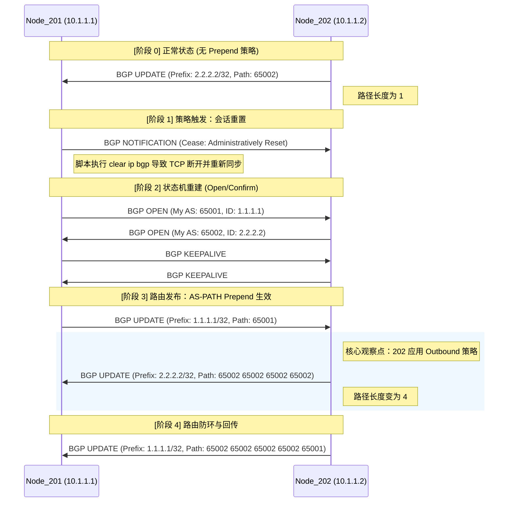

# 📝 实验 02：BGP AS-PATH Prepend 协议交互分析

本报告基于实验抓包数据（`02_as_prepend_205949.pcap`），对 BGP 策略触发后的报文交互进行深度解读。

## 1. 协议交互全景图

#### **对比分析：策略生效前后**

1. **路径长度变化**：
* **策略前 (Baseline)**：AS_PATH 仅包含始发自治系统 `65002`。
* **策略后 (Experiment)**：AS_PATH 被人为填充为 `65002 65002 65002 65002`。

2. **选路决策影响**：
对于 Node_201 而言，如果有另一个邻居（假设为 Node_203）也通告 `2.2.2.2/32` 且路径长度小于 4，根据 BGP 选路原则第 4 条（Shortest AS_PATH），Node_201 将**放弃** Node_202 的路径。
3. **防环机制**：
观察 **阶段 4**，即便路径被填充，末尾依然保留了原始的 `65001`。这证明 Prepend 是在既有 AS_PATH 基础上进行的 **加权（Stacking）**，不会破坏 BGP 原有的环路检测逻辑。

---

## 2. 关键报文深度解析

### A. 会话切断 (Frame 1)

* **报文类型**: `NOTIFICATION`
* **关键属性**: `Error Code: Cease (6)`, `Error Subcode: Administratively Reset (4)`
* **解读**: 当我们在 201 节点执行 `clear ip bgp` 时，交换机发送此报文通知对端由于管理员操作需要断开连接。这确保了后续的路由信息是“新鲜”的全量同步，而非增量同步。

### B. 能力协商 (Frame 15 & 17)

* **报文类型**: `OPEN`
* **关键能力 (Capabilities)**:
* **4-octet AS Number**: 支持扩展 AS 号（65001/65002）。
* **Route Refresh**: 支持在不中断 TCP 的情况下请求邻居重新发送路由信息（后续 soft-reconfiguration 的基础）。
* **FQDN**: 交换机互相告知了主机名 `sonic`。

### C. 策略生效：AS-PATH 变长 (Frame 33)

这是本次实验最核心的证据。

* **报文类型**: `UPDATE`
* **Network Layer Reachability Information (NLRI)**: `2.2.2.2/32`
* **Path Attribute - AS_PATH**: `65002 65002 65002 65002`
* **协议底层细节**:
* `Segment Type: AS_SEQUENCE (2)`
* `Segment Length: 4`

* **分析**: 正常的 BGP 路由只需包含始发 AS 号。此处重复出现的 AS 号是由于 202 节点应用了 `route-map PREPEND_AS out`。
* **影响**: 任何收到此报文的路由器都会认为到达 `2.2.2.2/32` 需要经过 4 个自治系统，从而极大地降低了该路径在选路算法中的优先级。

### D. 路由传递与变长 (Frame 39)

* **分析**: 202 将从 201 学到的 `1.1.1.1/32` 重新发布给 201。
* **AS_PATH**: `65002 65002 65002 65002 65001`
* **解读**: 即使是转发的路由，只要是从 202 节点的这个接口出去，都会被挂载 Prepend 策略。201 收到后通常会因为 `AS_PATH` 包含自身（65001）而丢弃，起到防环作用。

---

## 3. 实验结论汇总

| 报文属性 | 实验前预期 | 实验后抓包结果 | 结论 |
| --- | --- | --- | --- |
| **AS_PATH 长度** | 1 (65002) | 4 (65002 x 4) | **策略执行成功** |
| **Total Path Attr Length** | 28 字节左右 | 40 字节 | **报文开销增加** |
| **选路优先级** | 正常 | 降低 | **实现入向流量控制** |

---