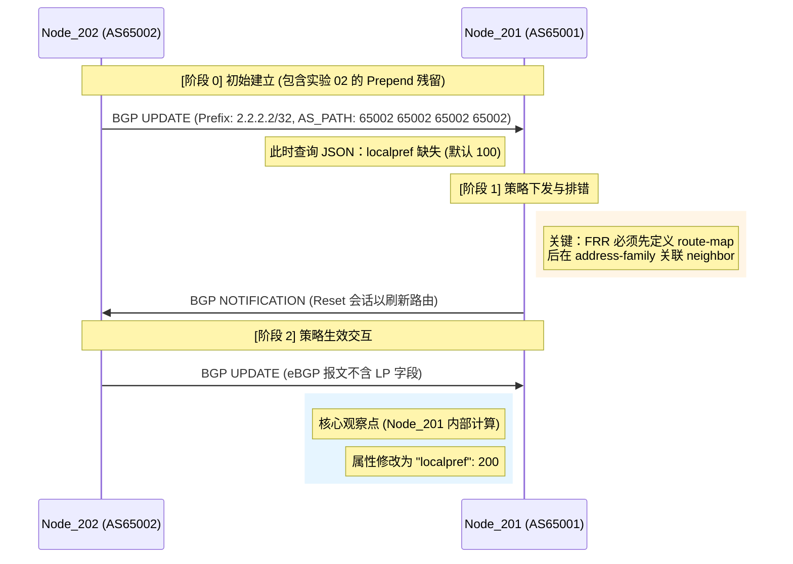

# 📝 实验 03：BGP Local Preference (LP) 深度解析

## 1. 实验目标与选路逻辑
本实验旨在验证 **Local Preference (本地优先级)** 属性对 BGP 选路决策的影响。Local Preference 用于告知 AS 内部路由器如何离开本自治系统（控制出向流量）。

### 选路准则优先级对照表
| 顺序 | 选路准则 (Best-Path Selection) | 实验关联 |
| :--- | :--- | :--- |
| 1 | Weight (思科私有/最高优先级) | - |
| **2** | **Local Preference** | **本实验 (03)** |
| 3 | Locally Originated (本地始发) | - |
| **4** | **Shortest AS_PATH** | **实验 (02)** |

> **核心结论**：Local Preference 的优先级（第2位）高于 AS_PATH（第4位）。即使路径再长，只要 LP 值更高，BGP 就会优选该路径。

---

## 2. 协议交互时序图




---

## 3. 实战证据分析 (JSON 数据)

在 Node_201 上执行 `sudo vtysh -c "show ip bgp 2.2.2.2/32 json"`，获取到真实的内存路由信息：

```json
{
  "prefix": "2.2.2.2/32",
  "paths": [
    {
      "aspath": {
        "string": "65002 65002 65002 65002",
        "length": 4
      },
      "localpref": 200,
      "bestpath": {
        "overall": true,
        "selectionReason": "First path received"
      }
    }
  ]
}

```

```text
sonic(config)#
sonic(config)# ! 1. 先定义 Route-map 本体
sonic(config)# route-map SET_LP_HIGH permit 10
sonic(config-route-map)#  set local-preference 200
sonic(config-route-map)# exit
sonic(config)#
sonic(config)# ! 2. 再次进入 BGP 确保关联成功
sonic(config)# router bgp 65001
sonic(config-router)#  address-family ipv4 unicast
sonic(config-router-af)#   neighbor 10.1.1.2 route-map SET_LP_HIGH in
sonic(config-router-af)#  exit
sonic(config-router)# exit
sonic(config)#
sonic(config)# ! 3. 退出到特权模式 (从 (config) 回到 #)
sonic(config)# end
sonic#
sonic# ! 4. 执行刷新命令 (注意：clear 不在 conf t 里面执行)
sonic# clear ip bgp 10.1.1.2
sonic#
sonic#
sonic# show ip bgp 2.2.2.2/32 json
{
  "prefix":"2.2.2.2\/32",
  "advertisedTo":{
    "10.1.1.2":{
      "hostname":"sonic"
    }
  },
  "paths":[
    {
      "pathId":0,
      "aspath":{
        "string":"65002 65002 65002 65002",
        "segments":[
          {
            "type":"as-sequence",
            "list":[
              65002,
              65002,
              65002,
              65002
            ]
          }
        ],
        "length":4
      },
      "origin":"IGP",
      "med":0,
      "metric":0,
      "localpref":200,
      "valid":true,
      "bestpath":{
        "overall":true,
        "selectionReason":"First path received"
      },
      "lastUpdate":{
        "epoch":1767452597,
        "string":"Sat Jan  3 15:03:17 2026\n"
      },
      "nexthops":[
        {
          "ip":"10.1.1.2",
          "afi":"ipv4",
          "metric":0,
          "accessible":true,
          "used":true
        }
      ],
      "peer":{
        "peerId":"10.1.1.2",
        "routerId":"2.2.2.2",
        "hostname":"sonic",
        "type":"external"
      }
    }
  ]
}
sonic#
sonic#
sonic# write memory
Note: this version of vtysh never writes vtysh.conf
Building Configuration...
Configuration saved to /etc/frr/zebra.conf
Configuration saved to /etc/frr/ospfd.conf
Configuration saved to /etc/frr/bgpd.conf
Configuration saved to /etc/frr/pimd.conf
Configuration saved to /etc/frr/staticd.conf
Configuration saved to /etc/frr/bfdd.conf
Configuration saved to /etc/frr/iptrackd.conf
sonic#
```

**分析记录：**

1. **策略叠加**：观察到 `aspath` 长度为 4，说明实验 02 的 Prepend 策略依然在对端生效。
2. **LP 成功注入**：`localpref` 字段显示为 `200`，证明 `route-map ... in` 策略成功触发。
3. **选路结果**：尽管 AS_PATH 较长，但该路径依然被标记为 `bestpath: true`，验证了 LP 的高优先级。

---

## 4. 关键知识点总结 (Non-transitive)

1. **报文不可见性**：在 eBGP 链路（201-202 之间）抓包无法看到 LP 属性。这是因为 LP 是 **Well-known Discretionary** 属性，但它**只能在 AS 内部传播**（Non-transitive to eBGP peers）。
2. **入向策略 (Inbound)**：在 eBGP 环境下，我们通常通过 `in` 方向的 route-map 来人为赋予接收到的路由一个 LP 值，从而引导本 AS 内的所有路由器从该邻居出口。
3. **FRR 配置依赖**：
* 必须先创建 `route-map` 实体。
* `clear ip bgp` 等运维命令需在特权模式（`#`）而非配置模式（`(config)#`）执行。
